  

  

  
  
  

---

### ⚡ Skills

  
  
  
  
  
  
  
  
  
  
  
  
  
  
  
  
  

---

### 🚀 Featured Projects

<table align="center">
  <tr>
    <td align="center">
      
    </td>
    <td align="center">
      
    </td>
    <td align="center">
      
    </td>
  </tr>
</table>

---

### 🌐 Connect

  
  
  

  

